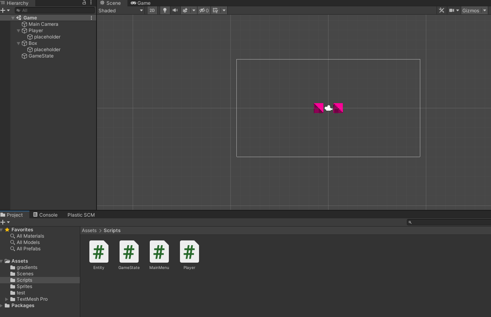
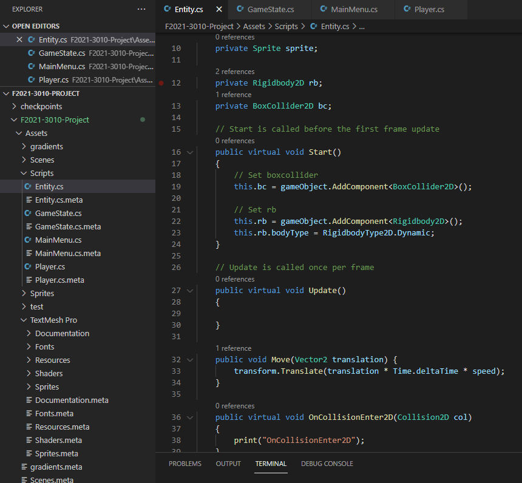
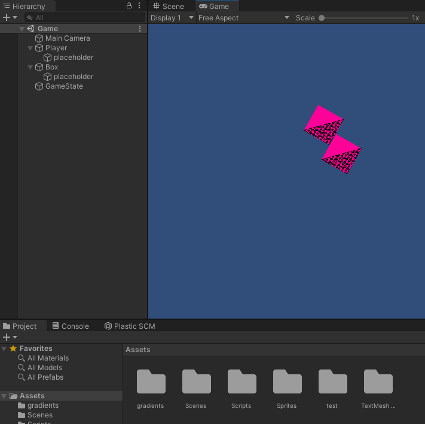
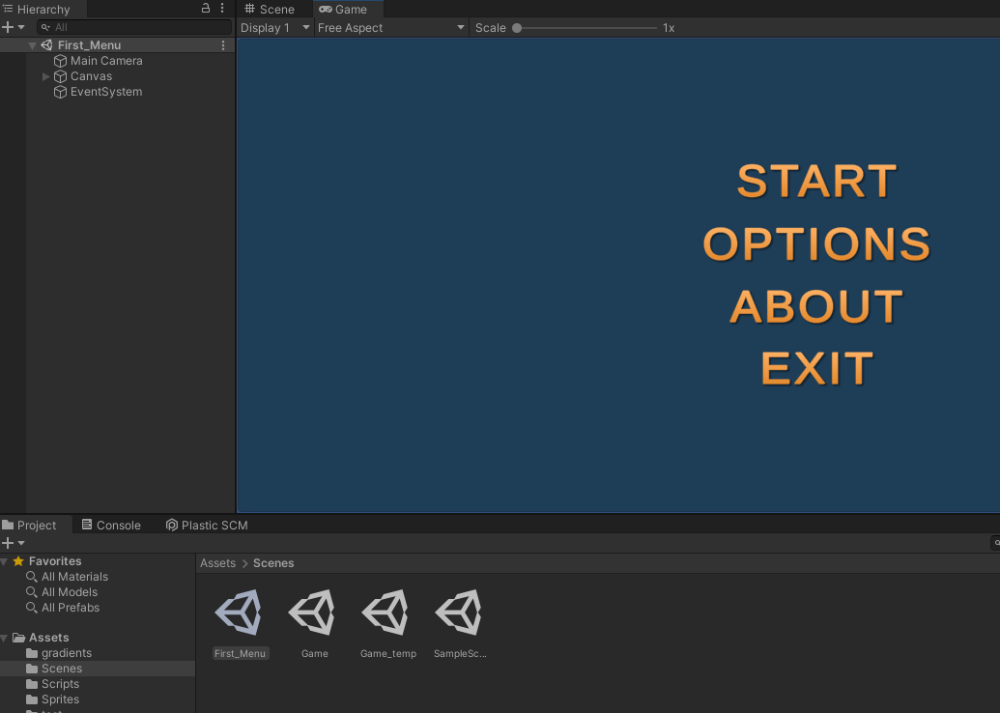
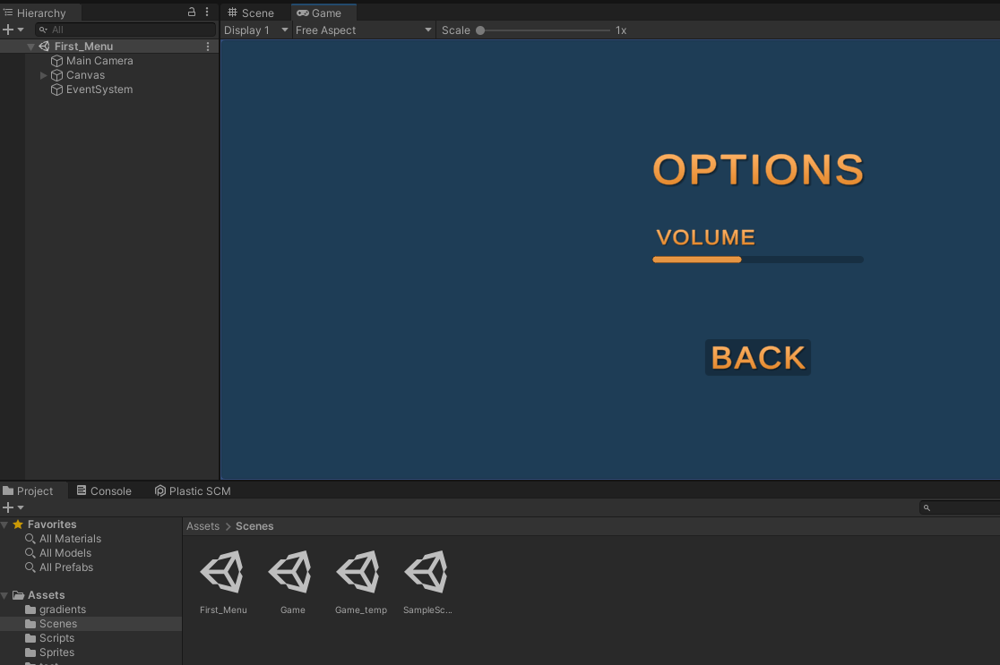

Names: William McLaughlin, Ian McKibben
Date: 10 / 22 / 2021

# Homework 3 - Individual Projects

## Section 1: Planned Features
* Collision: Basic collision recognition between Player and other objects
* Player HP: Hitpoints tracking for the Player, so they can take damage
* Point System: Point tracking system to keep track of the Player’s progress
* Basic Menu GUI: Basic functioning GUI so the Player can begin and end the game
* Art Concepts: Basic art drawings and ideas for the eventual graphics

## Section 2: Accomplished Features
* Collision: Added dynamically created colliders in the Entity class and virtual collision functions that will be overwritten by the Enemy, Player, and other subclasses of Entity which require custom behavior.
* Player HP: Added member to player subclass which handles HP.
* Point System: Created GameState class which will manage points, instance will be created by GameManager
* Basic Menu GUI: Set up a simple UI that can open the game scene, exit the game, and access an options menu (with an example slider that does not function).
* Art Concepts: Chose to go with a ‘train’ based map theme, came up with basic sketches for how the game will look generally, focusing on shape and structure over specific art. See ‘Art Concepts’ document on project github

## Section 3: Next Homework Plan
* Procedural Map: A beginning functional procedural map generation, to be made more complex as the project progresses
* Moving Enemies: Movement behavior for enemies so they can move around the map
* Basic Functional Art: Some art functioning in the game to start giving it graphics

## Section 4: Screenshots
The unity editor for the main game scene, with two objects which can collide with one another.

The entity script and file hierarchy of the scripts added to the game.

The game preview window in the editor showing the game running with the boxs having collided and pushed around.

The basic main menu UI set up for the game.

The basic options menu, showing an example volume slider.

(Progress on art planning / progress is posted in the 'Art Concepts' document in the main folder of the project github.)

