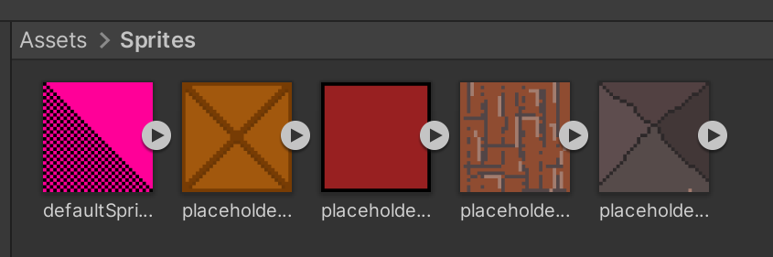
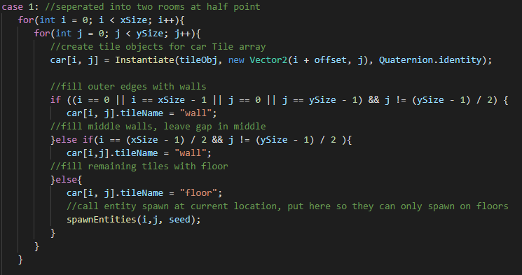
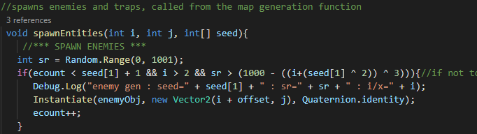

Names: William McLaughlin, Ian McKibben
Date: 10 / 22 / 2021

# Homework 4 - Individual Projects

## Section 1: Planned Features
* Procedural Map: A beginning functional procedural map generation, to be made more complex as the project progresses
* Moving Enemies: Movement behavior for enemies so they can move around the map
* Basic Functional Art: Some art functioning in the game to start giving it graphics

## Section 2: Accomplished Features
* Procedural Map: Made a functioning procedurally generated map, it generates a car and enemies randomly, deleting old parts of the map as new ones are added.
* Movindg Enemies: Made a generic momentum and angle based system for a simple red enemy.
* Basic Functional Art: Created filler sprites for each component we have.

## Section 3: Next Homework Plan
* Abstracting game state: Creating the GameManager which will contain the map, a game state (with a score), as well as a collection of all entities on the board such as players and enemies.
* Managing classes: Creating subclasses of enemies and game entities with unique properties to add into our procedural generation.
* Instantiating prototypes: Enabling the map to instantiate subclasses of Entities on procedural generation such that they perform their behaviors on game start.

## Section 4: Screenshots

Enemies move in basic circles and will be removed from the board once they come into contact with the player enough times.

Relevant Code: This function overrides the virtual Entity::Update to create custom behavior for the Enemy

```
public override void Update()
{
    angleChange += Random.Range(-angleChangeRange, angleChangeRange) * Time.deltaTime;
    angle += angleChange;

    speedChange = Random.Range(-speedChangeRange, speedChangeRange) * Time.deltaTime;
    speed += speedChange;

    Move(new Vector2(Mathf.Sin(angle), Mathf.Cos(angle)));
}
```

This function overrides the virtual Entity::OnCollisionEnter2D, which defines custom collision behavior

```
public override void OnCollisionEnter2D(Collision2D col)
{
    hp -= 10.0f;
    print("Enemy lost hp, " + hp.ToString() + " left");
    if (hp <= 0.0f) {
        DestroyEntity();
    }
}
```


Screenshot of basic art.



The procedural generation works by running a generateCar() function each time one is needed, deleting the passed cars as new ones are added.
All the code for this cannot fit here, it is in "Map.cs" under the scripts folder in the project's assets.

This is one example of car generation out of the generateCar() function:


This is the function that generates the entities for the car, enemies and traps, traps are not yet implemented:


Procedural Generation Video:
https://github.com/IanMckibb/F2021-3010-Project/blob/2e4c05e0766ab04e0c22e0948108ee2532ef0a9f/checkpoints/images/h4v1.mp4
